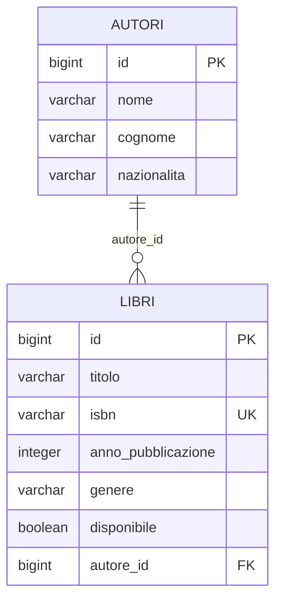

# Dati di prova e schema del database

<!-- parte: B · Svolgere la traccia | quando: 12:40 | durata: 10 minuti | obiettivo: Le tabelle si riempiono da sole di righe credibili a ogni avvio, e hai lo schema concettuale e logico per l'allegato, letto dal database vero. -->

Una demo su tabelle vuote non si vede, e lo schema del database vale punti
nell'allegato. Scritte le entity, sono due comandi, e tutti e due lavorano sul
database vero: avviano l'applicazione, lasciano che Hibernate crei le tabelle
e lavorano su quelle.

## I dati di prova

```bash
task seed-data
```

L'uscita vera, sul branch della Biblioteca:

```text
  catalogo-service/src/main/resources/application.yml  dev-data.rows: 5
  prestiti-service/src/main/resources/application.yml  dev-data.rows: 5

==> Prova su un database H2 usa-e-getta
  compilo con Maven...

  catalogo-service
    AutoreEntity: 5 righe nuove
    LibroEntity: 5 righe nuove
    dati di prova: 2 entity riempite
    righe per tabella: autori 5, libri 5

  prestiti-service
    PrestitoEntity: 5 righe nuove
    dati di prova: 1 entity riempite
    righe per tabella: prestiti 5

Dati di prova pronti.
```

Il comando scrive due righe nell'`application.yml` di ogni modulo con delle
`@Entity`:

```yaml demo/catalogo-service/src/main/resources/application.yml
dev-data:
  rows: 5
```

e da lì in poi, a ogni avvio, il pacchetto `devdata` di `common-dto` riempie
le tabelle **ancora vuote**. Costruisce oggetti delle tue entity con valori
inventati e li salva passando da Hibernate, come farebbe il tuo codice. Per
questo rispetta quello che rispetta la tua applicazione:

- gli id li genera chi deve; le relazioni puntano a righe che esistono, perché
  le tabelle si riempiono nell'ordine giusto (prima `autori`, poi `libri`);
- gli enum sono i tuoi; lunghezze, `@NotNull`, `@Min`/`@Max`, `@Email` e
  perfino `@Pattern`: gli ISBN escono di tredici cifre che cominciano con 978 o
  979;
- i valori seguono il nome del campo e dell'entity: il `titolo` di un libro è
  il titolo di un libro, un'`email` è un'email, un `cognome` è un cognome.

Un riavvio non duplica niente, perché si riempiono solo le tabelle vuote; vale
su H2, su PostgreSQL e in Docker. Prima di finire, il comando prova tutto su un
H2 usa-e-getta e ti dice tabella per tabella com'è andata: se una entity non
entra, lo scopri adesso e non davanti alla commissione.

| Variante | Che cosa fa |
| :--- | :--- |
| `task seed-data SERVICE=catalogo-service ROWS=10` | un modulo solo, dieci righe |
| `task seed-data ROWS=0` | spenti |
| `task seed-data CHECK=0` | scrive la configurazione senza la prova |

### Che cosa non può sapere

`PrestitoEntity.libroId` non è una relazione: è un numero che punta a un libro
di un altro servizio. I dati di prova gli danno valori da 1 in su, gli id che il
catalogo ha davvero, così i titoli si risolvono. Ma una regola che attraversa
due servizi non la conoscono: può capitare un libro segnato come disponibile
con un prestito in corso. Per la demo va bene; se la traccia vuole dati
precisi (quei libri, quegli utenti) scrivili in un `data.sql` tuo. Le tabelle
che riempie lui non vengono toccate. Perché venga eseguito dopo Hibernate,
anche su PostgreSQL:

```yaml demo/catalogo-service/src/main/resources/application.yml
spring:
  jpa:
    defer-datasource-initialization: true
  sql:
    init:
      mode: always
```

## Lo schema del database

```bash
task db-schema
```

Avvia ogni modulo con delle entity su un H2 usa-e-getta e interroga le tabelle
che Hibernate ha creato. Il database del progetto non lo tocca, e funziona a
stack spento. Ne esce un documento Markdown con, per ogni modulo:

- il **modello concettuale**: le entità, i loro attributi e le relazioni con la
  cardinalità;
- il **modello logico**: tabelle, colonne, tipi SQL, chiavi primarie ed
  esterne, vincoli e valori ammessi degli enum;
- un **diagramma ER** in mermaid, che GitHub e VS Code disegnano da soli.

Un pezzo dell'uscita vera, per il catalogo:

```text
- **Autore** (id (identificatore), nome, cognome, nazionalita) -- classe `AutoreEntity`, tabella `autori`
- **Libro** (id (identificatore), titolo, isbn, annoPubblicazione, genere (ROMANZO | SAGGIO | GIALLO | FANTASY | STORICO), disponibile) -- classe `LibroEntity`, tabella `libri`

**Relazioni**

- **Libro** -> **Autore**: molti a uno, obbligatoria (campo `autore`)
```



È lo *schema concettuale e logico della base dati* che chiede l'allegato, e
`task consegna` lo mette da solo in `SCHEMA-DATABASE.md` e dentro
`ALLEGATO-TECNICO.md`. Per averlo in un file adesso:
`task db-schema OUT=schema.md`.

> **Prova tu**
>
> Lancia `task dev`, apri `http://localhost:8081/api/libri` e guarda i libri
> inventati. Poi riavvia (`task dev` di nuovo) e controlla che siano ancora
> cinque, non dieci.

> **Fatto quando**
>
> - [ ] `task seed-data` dice che ogni entity si è riempita
> - [ ] dopo un riavvio le righe non sono raddoppiate
> - [ ] hai lo schema, e sai che lo mette da solo anche la consegna
