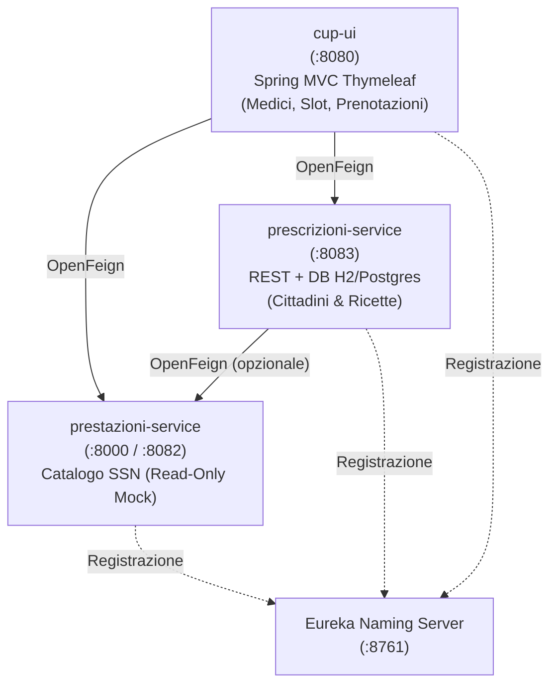

# Guida Pratica alla Simulazione d'Esame: Microservizi e Prenotazione Ospedaliera

Questa guida ti accompagna passo-passo nella simulazione completa della **traccia più probabile e completa** per l'esame finale ITS (Biennio 2023/2025, 40 punti totali, 6 ore a disposizione):
> **"Sviluppo di un sistema di prenotazione ospedaliera basato su microservizi (Ospedale Sant'Isidoro di Siviglia e Sistema Regionale Prescrizioni SSN)"**

Grazie al template, **tutto il boilerplate infrastrutturale (Eureka, OpenAPI/Swagger, Feign, Docker Compose, configurazioni YAML, schema DB, seed SQL, packaging)** è automatizzato al 100%. Tu devi solo eseguire i comandi `task` indicati e scrivere la **pura logica di business e l'algoritmo**.

---

## 🎯 Quadro Valutazione (40 Punti)

| Sezione | Punti | Obiettivo | Automazione Template |
| :--- | :---: | :--- | :--- |
| **S1. Allegato Tecnico** | **6 pt** | Analisi, architettura moduli/porte, schema logico DB, istruzioni test | `task allegato` compila tutto al 90% |
| **S2. Eureka Naming Server** | **4 pt** | Service Discovery attivo su porta 8761 | `naming-server` pronto all'avvio |
| **S3. Anagrafica Prestazioni** | **4 pt** | Semilavorato mock registrato su Eureka | `task import-service` in 1 comando |
| **S4. Prescrizioni SSN** | **8 pt** | Servizio REST con DB (Persona, Prescrizione), validazione, Swagger | `task new-service` + `task new-entity` + CRUD |
| **S5. Webapp CUP / Prenotazione** | **10 pt** | UI Thymeleaf, Feign Clients, Medici, Slot, Algoritmo matching e prenotazione | `task new-service UI=1` + `task new-client` + Algoritmo |
| **S6. Domanda Teorica A** | **4 pt** | Docker, Compose, API Gateway e Sicurezza Microservizi | Template risposte complete fornite in questa guida |
| **S7. Domanda Teorica B** | **4 pt** | SQL vs NoSQL, Spring Boot vs Jakarta EE | Template risposte complete fornite in questa guida |

---

## 🗺️ Architettura e Porte della Soluzione



---

## FASE 0: Sanity Check Iniziale (3 minuti)

Verifica che l'ambiente sia integro e pronto:

```powershell
# 1. Controlla che il template sia coerente
task check

# 2. Controlla che le dipendenze offline siano pronte
task offline

# 3. Avvia lo stack iniziale per verificare che Eureka parta regolarmente
task dev
```

Apri il browser su `http://localhost:8761`: vedrai la dashboard di Eureka Naming Server attiva.

---

## FASE 1: Importazione del Servizio Semilavorato (4 Punti - 5 minuti)

La traccia fornisce un semilavorato (`prestazioni-service.zip`) contenente il catalogo in-memory delle prestazioni mediche SSN.
La richiesta d'esame è: *"Sorgente del programma opportunamente modificato per registrarsi su naming server EUREKA"*.

Esegui semplicemente:
```powershell
task import-service SRC="C:\Users\Utente\Downloads\simulazione seconda prova-20260912T125145Z-1-001\simulazione seconda prova\prestazioni-service.zip"
```

### Cosa fa il template in automatico:
1. Scompatta il codice in `demo/prestazioni-service/`.
2. Aggiunge `spring-cloud-starter-netflix-eureka-client` e `springdoc-openapi-starter-webmvc-ui` nel `pom.xml`.
3. Configura `application.yml` con l'indirizzo di Eureka (`defaultZone: ${EUREKA_SERVER_URL:http://localhost:8761/eureka/}`) e porta configurabile.
4. Registra il modulo in `demo/pom.xml`, `Dockerfile`, `docker-compose.yml`, `dev.ps1`, `dev.sh` e sincronizza l'IDE.

Riavvia lo stack per compilare e avviare il nuovo servizio:
```powershell
task dev
```

### Verifica:
- Su `http://localhost:8761`: compare l'istanza `PRESTAZIONI-SERVICE`.
- Su `http://localhost:8000/swagger-ui.html` (o la porta assegnata): puoi testare i metodi `GET /prestazioni` e `GET /prestazioni/{codice}`.

---

## FASE 2: Creazione del Servizio Prescrizioni SSN (8 Punti - 5 minuti)

Crea il microservizio REST con database:
```powershell
# 1. Crea il microservizio su porta 8083
task new-service NAME=prescrizioni-service PORT=8083

# 2. Crea l'entità Persona (Cittadini: curanti e pazienti)
task new-entity SERVICE=prescrizioni-service NAME=Persona FIELDS="codiceFiscale:string(16):required:unique,nome:string:required,cognome:string:required"

# 3. Crea l'entità Prescrizione
task new-entity SERVICE=prescrizioni-service NAME=Prescrizione FIELDS="codicePrestazione:string:required,cfMedico:string(16):required,cfPaziente:string(16):required,dataCreazione:date,dataScadenza:date,stato:string"
```

---

## FASE 3: Logica di Business di `prescrizioni-service` (15 minuti)

La traccia richiede:
1. Inserimento nuova prescrizione:
   - Riceve CF medico, CF paziente, codice prestazione, data scadenza.
   - Genera ID, imposta `dataCreazione = LocalDate.now()`, `stato = "EMESSA"`.
   - Fallisce se i CF non esistono nel DB locale o se `dataScadenza < LocalDate.now()`.
2. Dettaglio prescrizione (`GET /prescrizioni/{id}`): restituisce i dati della ricetta con nome e cognome di paziente e medico.
3. Transizione stato (`PUT /prescrizioni/{id}/prenota`):
   - Fallisce con errore descrittivo se la ricetta non esiste o se è già in stato `PRENOTATA`.
   - Se valida, imposta lo stato a `PRENOTATA`.

### Codice da inserire in `demo/prescrizioni-service/`

#### 1. Modello e Relazioni
In `demo/prescrizioni-service/src/main/java/esame/prescrizioniservice/model/Prescrizione.java`:
Assicurati che l'entità contenga i campi necessari e i metodi getter/setter (o Lombok `@Data` / `@Builder`).

#### 2. Service (`PrescrizioneService.java`)
Apri `demo/prescrizioni-service/src/main/java/esame/prescrizioniservice/service/PrescrizioneService.java` e implementa la logica:

```java
package esame.prescrizioniservice.service;

import esame.prescrizioniservice.model.Persona;
import esame.prescrizioniservice.model.PersonaRepository;
import esame.prescrizioniservice.model.Prescrizione;
import esame.prescrizioniservice.model.PrescrizioneRepository;
import org.springframework.beans.factory.annotation.Autowired;
import org.springframework.http.HttpStatus;
import org.springframework.stereotype.Service;
import org.springframework.transaction.annotation.Transactional;
import org.springframework.web.server.ResponseStatusException;

import java.time.LocalDate;

@Service
@Transactional
public class PrescrizioneService {

    @Autowired
    private PrescrizioneRepository prescrizioneRepository;

    @Autowired
    private PersonaRepository personaRepository;

    public Prescrizione crea(String codicePrestazione, String cfPaziente, String cfMedico, LocalDate dataScadenza) {
        if (dataScadenza != null && dataScadenza.isBefore(LocalDate.now())) {
            throw new ResponseStatusException(HttpStatus.BAD_REQUEST, "La data di scadenza non puo' essere antecedente a oggi");
        }

        Persona paziente = personaRepository.findByCodiceFiscale(cfPaziente)
                .orElseThrow(() -> new ResponseStatusException(HttpStatus.BAD_REQUEST, "Paziente non trovato con CF: " + cfPaziente));

        Persona medico = personaRepository.findByCodiceFiscale(cfMedico)
                .orElseThrow(() -> new ResponseStatusException(HttpStatus.BAD_REQUEST, "Medico curante non trovato con CF: " + cfMedico));

        Prescrizione p = new Prescrizione();
        p.setCodicePrestazione(codicePrestazione);
        p.setCfPaziente(paziente.getCodiceFiscale());
        p.setCfMedico(medico.getCodiceFiscale());
        p.setDataCreazione(LocalDate.now());
        p.setDataScadenza(dataScadenza);
        p.setStato("EMESSA");

        return prescrizioneRepository.save(p);
    }

    public Prescrizione prenota(Long id) {
        Prescrizione p = prescrizioneRepository.findById(id)
                .orElseThrow(() -> new ResponseStatusException(HttpStatus.NOT_FOUND, "Prescrizione non trovata"));

        if ("PRENOTATA".equalsIgnoreCase(p.getStato())) {
            throw new ResponseStatusException(HttpStatus.BAD_REQUEST, "Prescrizione gia' prenotata");
        }

        p.setStato("PRENOTATA");
        return prescrizioneRepository.save(p);
    }

    public Prescrizione getById(Long id) {
        return prescrizioneRepository.findById(id)
                .orElseThrow(() -> new ResponseStatusException(HttpStatus.NOT_FOUND, "Prescrizione non trovata"));
    }
}
```

#### 3. Controller REST (`PrescrizioneController.java`)
Aggiorna il controller per esporre gli endpoint richiesti:

```java
package esame.prescrizioniservice.controller;

import esame.prescrizioniservice.model.Persona;
import esame.prescrizioniservice.model.PersonaRepository;
import esame.prescrizioniservice.model.Prescrizione;
import esame.prescrizioniservice.service.PrescrizioneService;
import io.swagger.v3.oas.annotations.Operation;
import io.swagger.v3.oas.annotations.tags.Tag;
import lombok.Builder;
import lombok.Data;
import org.springframework.beans.factory.annotation.Autowired;
import org.springframework.http.HttpStatus;
import org.springframework.web.bind.annotation.*;

import java.time.LocalDate;

@RestController
@RequestMapping("/prescrizioni")
@Tag(name = "Prescrizioni", description = "Gestione delle ricette mediche SSN")
public class PrescrizioneController {

    @Autowired
    private PrescrizioneService prescrizioneService;

    @Autowired
    private PersonaRepository personaRepository;

    @Data
    public static class NuovaPrescrizioneRequest {
        private String codicePrestazione;
        private String cfPaziente;
        private String cfMedico;
        private LocalDate dataScadenza;
    }

    @Data
    @Builder
    public static class PrescrizioneDettaglioDTO {
        private Long id;
        private String codicePrestazione;
        private LocalDate dataCreazione;
        private LocalDate dataScadenza;
        private String stato;
        private String cfPaziente;
        private String nomePaziente;
        private String cognomePaziente;
        private String cfMedico;
        private String nomeMedico;
        private String cognomeMedico;
    }

    @PostMapping
    @ResponseStatus(HttpStatus.CREATED)
    @Operation(summary = "Crea una nuova prescrizione medica")
    public Prescrizione crea(@RequestBody NuovaPrescrizioneRequest req) {
        return prescrizioneService.crea(req.getCodicePrestazione(), req.getCfPaziente(), req.getCfMedico(), req.getDataScadenza());
    }

    @GetMapping("/{id}")
    @Operation(summary = "Recupera una prescrizione completa di anagrafica")
    public PrescrizioneDettaglioDTO getById(@PathVariable Long id) {
        Prescrizione p = prescrizioneService.getById(id);
        Persona paz = personaRepository.findByCodiceFiscale(p.getCfPaziente()).orElse(null);
        Persona med = personaRepository.findByCodiceFiscale(p.getCfMedico()).orElse(null);

        return PrescrizioneDettaglioDTO.builder()
                .id(p.getId())
                .codicePrestazione(p.getCodicePrestazione())
                .dataCreazione(p.getDataCreazione())
                .dataScadenza(p.getDataScadenza())
                .stato(p.getStato())
                .cfPaziente(p.getCfPaziente())
                .nomePaziente(paz != null ? paz.getNome() : "")
                .cognomePaziente(paz != null ? paz.getCognome() : "")
                .cfMedico(med != null ? med.getCodiceFiscale() : "")
                .nomeMedico(med != null ? med.getNome() : "")
                .cognomeMedico(med != null ? med.getCognome() : "")
                .build();
    }

    @PutMapping("/{id}/prenota")
    @Operation(summary = "Marca una prescrizione come PRENOTATA")
    public void prenota(@PathVariable Long id) {
        prescrizioneService.prenota(id);
    }
}
```

---

## FASE 4: Scaffolding Webapp CUP e Client OpenFeign (10 Punti - 10 minuti)

La traccia richiede:
*"Applicazione WEB (basata su tecnologia SPRING-MVC o similare) per il CUP di prenotazione. Gestisce l'anagrafica dei medici dell'ospedale, gli slot di disponibilità e la creazione di prenotazioni relative alle prescrizioni mediche."*

Esegui:
```powershell
# 1. Crea il modulo UI con Spring MVC + Thymeleaf su porta 8080
task new-service NAME=cup-ui UI=1 PORT=8080

# 2. Genera il Feign Client per collegare il CUP a prescrizioni-service
task new-client FROM=cup-ui TO=prescrizioni-service NAME=PrescrizioniClient ROUTE=/prescrizioni

# 3. Genera il Feign Client per collegare il CUP a prestazioni-service
task new-client FROM=cup-ui TO=prestazioni-service NAME=PrestazioniClient ROUTE=/prestazioni

# 4. Crea le entità del database locale del CUP
task new-entity SERVICE=cup-ui NAME=Medico FIELDS="codiceFiscale:string(16):required:unique,nome:string:required,cognome:string:required,specialita:string:required"
task new-entity SERVICE=cup-ui NAME=Slot FIELDS="data:date:required,ora:int:required,cfMedico:string(16):required,prenotato:bool"
task new-entity SERVICE=cup-ui NAME=Prenotazione FIELDS="idPrescrizione:long:required,codicePrestazione:string:required,slotId:long:required,cfPaziente:string,nomePaziente:string,cognomePaziente:string"
```

---

## FASE 5: Implementazione Algoritmo di Prenotazione nel CUP (20 minuti)

Nel modulo `cup-ui`, implementiamo il core business richiesto:
1. L'utente inserisce il codice prescrizione.
2. Il sistema interroga `prescrizioni-service` via Feign.
3. Se la ricetta è `EMESSA` e `dataScadenza >= LocalDate.now()`, recupera la prestazione da `prestazioni-service` per ricavarne la `specialita`.
4. Cerca tutti gli slot con:
   - `data > LocalDate.now()` (dal giorno successivo in poi)
   - Medico con specialità corrispondente
   - Slot non ancora prenotato (`prenotato == false` o `prenotazione == null`).
5. Quando il paziente seleziona lo slot e conferma:
   - Crea il record `Prenotazione` nel DB locale del CUP.
   - Marca lo slot come prenotato.
   - Chiama `prescrizioniClient.prenota(id)` via Feign per marcare la ricetta SSN come `PRENOTATA`.
   - Mostra a video l'ID della prenotazione confermata.

### Codice del Controller Spring MVC (`demo/cup-ui/src/main/java/.../controller/CupController.java`)

```java
package esame.cupui.controller;

import esame.cupui.client.PrescrizioniClient;
import esame.cupui.client.PrestazioniClient;
import esame.cupui.model.*;
import org.springframework.beans.factory.annotation.Autowired;
import org.springframework.stereotype.Controller;
import org.springframework.ui.Model;
import org.springframework.web.bind.annotation.*;

import java.time.LocalDate;
import java.util.ArrayList;
import java.util.List;

@Controller
@RequestMapping("/")
public class CupController {

    @Autowired
    private PrescrizioniClient prescrizioniClient;

    @Autowired
    private PrestazioniClient prestazioniClient;

    @Autowired
    private MedicoRepository medicoRepository;

    @Autowired
    private SlotRepository slotRepository;

    @Autowired
    private PrenotazioneRepository prenotazioneRepository;

    @GetMapping
    public String index(Model model) {
        return "cup";
    }

    @PostMapping("/cerca")
    public String cercaPrescrizione(@RequestParam("idPrescrizione") Long idPrescrizione, Model model) {
        model.addAttribute("idPrescrizione", idPrescrizione);

        // 1. Chiamata Feign a prescrizioni-service
        var p = prescrizioniClient.getById(idPrescrizione);
        if (p == null) {
            model.addAttribute("errore", "Prescrizione non trovata nel sistema SSN.");
            return "cup";
        }
        model.addAttribute("prescrizione", p);

        // 2. Verifica stato e scadenza
        if (!"EMESSA".equalsIgnoreCase(p.getStato())) {
            model.addAttribute("errore", "La prescrizione risulta gia' " + p.getStato() + ".");
            return "cup";
        }
        if (p.getDataScadenza() != null && p.getDataScadenza().isBefore(LocalDate.now())) {
            model.addAttribute("errore", "La prescrizione e' scaduta il " + p.getDataScadenza() + ".");
            return "cup";
        }

        // 3. Chiamata Feign ad anagrafica prestazioni per ricavare la specialità
        var prestazione = prestazioniClient.getByCodice(p.getCodicePrestazione());
        String specialita = (prestazione != null) ? prestazione.getSpecialita() : null;

        // 4. ALGORITMO: Filtro slot dal giorno successivo per i medici con quella specialità
        List<Medico> mediciSpecialita = medicoRepository.findBySpecialita(specialita);
        List<String> cfMedici = mediciSpecialita.stream().map(Medico::getCodiceFiscale).toList();

        List<Slot> slotDisponibili = slotRepository.findByDataGreaterThanAndCfMedicoInAndPrenotatoFalse(
                LocalDate.now(), cfMedici);

        if (slotDisponibili.isEmpty()) {
            model.addAttribute("messaggio", "Nessuno slot disponibile da domani in poi per la specialita' " + specialita);
        } else {
            model.addAttribute("slots", slotDisponibili);
        }

        return "cup";
    }

    @PostMapping("/prenota")
    public String confermaPrenotazione(
            @RequestParam("slotId") Long slotId,
            @RequestParam("idPrescrizione") Long idPrescrizione,
            Model model) {

        Slot slot = slotRepository.findById(slotId).orElse(null);
        if (slot == null || Boolean.TRUE.equals(slot.getPrenotato())) {
            model.addAttribute("errore", "Slot non piu' disponibile.");
            return "cup";
        }

        var p = prescrizioniClient.getById(idPrescrizione);

        // 1. Salva prenotazione locale nel CUP
        Prenotazione prenotazione = new Prenotazione();
        prenotazione.setSlotId(slotId);
        prenotazione.setIdPrescrizione(idPrescrizione);
        prenotazione.setCodicePrestazione(p.getCodicePrestazione());
        prenotazione.setCfPaziente(p.getCfPaziente());
        prenotazione.setNomePaziente(p.getNomePaziente());
        prenotazione.setCognomePaziente(p.getCognomePaziente());
        prenotazioneRepository.save(prenotazione);

        // 2. Aggiorna lo slot
        slot.setPrenotato(true);
        slotRepository.save(slot);

        // 3. Chiamata Feign per marcare la prescrizione sul SSN
        prescrizioniClient.prenota(idPrescrizione);

        model.addAttribute("successo", "Prenotazione confermata con successo! ID Prenotazione: " + prenotazione.getId());
        return "cup";
    }
}
```

### Template HTML Thymeleaf (`demo/cup-ui/src/main/resources/templates/cup.html`)

```html
<!DOCTYPE html>
<html xmlns:th="http://www.thymeleaf.org">
<head>
    <meta charset="UTF-8">
    <title>CUP Ospedaliero - Sant'Isidoro</title>
    <style>
        body { font-family: -apple-system, BlinkMacSystemFont, "Segoe UI", Roboto, sans-serif; margin: 40px; background: #f8fafc; color: #1e293b; }
        .card { background: white; padding: 24px; border-radius: 8px; box-shadow: 0 1px 3px rgba(0,0,0,0.1); max-width: 800px; margin-bottom: 24px; }
        .alert-error { background: #fee2e2; color: #991b1b; padding: 12px; border-radius: 6px; margin-bottom: 16px; }
        .alert-success { background: #dcfce7; color: #166534; padding: 16px; border-radius: 6px; font-size: 1.1em; font-weight: bold; }
        table { width: 100%; border-collapse: collapse; margin-top: 16px; }
        th, td { padding: 12px; border-bottom: 1px solid #e2e8f0; text-align: left; }
        button { background: #2563eb; color: white; border: none; padding: 10px 18px; border-radius: 6px; cursor: pointer; font-weight: 500; }
        button:hover { background: #1d4ed8; }
        input[type="number"] { padding: 8px 12px; border: 1px solid #cbd5e1; border-radius: 6px; font-size: 1em; width: 250px; }
    </style>
</head>
<body>

<h1>Ospedale Sant'Isidoro di Siviglia</h1>
<h2>Centro Unico Prenotazioni (CUP)</h2>

<div class="card">
    <form method="post" th:action="@{/cerca}">
        <label><strong>Codice Prescrizione Elettronica SSN:</strong></label><br><br>
        <input type="number" name="idPrescrizione" th:value="${idPrescrizione}" placeholder="Es. 1" required>
        <button type="submit">Cerca Disponibilità</button>
    </form>
</div>

<div th:if="${errore}" class="alert-error" th:text="${errore}"></div>
<div th:if="${successo}" class="alert-success" th:text="${successo}"></div>

<div th:if="${prescrizione}" class="card">
    <h3>Dati Prescrizione</h3>
    <p><strong>Paziente:</strong> <span th:text="${prescrizione.nomePaziente + ' ' + prescrizione.cognomePaziente + ' (' + prescrizione.cfPaziente + ')'}"></span></p>
    <p><strong>Medico Curante:</strong> <span th:text="${prescrizione.nomeMedico + ' ' + prescrizione.cognomeMedico}"></span></p>
    <p><strong>Codice Prestazione:</strong> <span th:text="${prescrizione.codicePrestazione}"></span></p>
    <p><strong>Stato Ricetta:</strong> <span th:text="${prescrizione.stato}"></span></p>
    <p><strong>Data Scadenza:</strong> <span th:text="${prescrizione.dataScadenza}"></span></p>
</div>

<div th:if="${slots}" class="card">
    <h3>Slot Disponibili per la Visita Specialistica</h3>
    <table>
        <thead>
            <tr>
                <th>Data</th>
                <th>Ora</th>
                <th>CF Medico</th>
                <th>Azione</th>
            </tr>
        </thead>
        <tbody>
            <tr th:each="slot : ${slots}">
                <td th:text="${slot.data}"></td>
                <td th:text="${slot.ora + ':00'}"></td>
                <td th:text="${slot.cfMedico}"></td>
                <td>
                    <form method="post" th:action="@{/prenota}">
                        <input type="hidden" name="slotId" th:value="${slot.id}">
                        <input type="hidden" name="idPrescrizione" th:value="${prescrizione.id}">
                        <button type="submit">Prenota questo Slot</button>
                    </form>
                </td>
            </tr>
        </tbody>
    </table>
</div>

</body>
</html>
```

---

## FASE 6: Dati di Prova e Collaudo Completo (10 minuti)

Per testare l'intera catena e soddisfare la richiesta d'esame:
> *"Il DB deve contenere dati di esempio utilizzabili per i test della soluzione OPPURE realizzare un metodo di inizializzazione dei dati"*

Esegui il generatore automatico di dati coerenti:
```powershell
task seed-data
```

Il comando popola le tabelle dei cittadini, medici e slot disponibili dal giorno successivo.
Riavvia lo stack con `task dev`.

### Esecuzione del Test:
1. **Swagger `prescrizioni-service` (`http://localhost:8083/swagger-ui.html`)**:
   - Esegui una `GET /prescrizioni/1` per verificare la presenza di una prescrizione `EMESSA`.
2. **Webapp CUP (`http://localhost:8080`)**:
   - Inserisci `1` nel campo codice prescrizione e clicca **Cerca Disponibilità**.
   - Verifica che compaiano gli slot disponibili dal giorno successivo in poi per la specialità richiesta.
   - Clicca **Prenota questo Slot**.
   - Verifica che a video compaia il messaggio di conferma: `Prenotazione confermata con successo! ID Prenotazione: 1`.
   - Se cerchi nuovamente la prescrizione `1`, il sistema risponderà: `La prescrizione risulta già PRENOTATA`.

---

## FASE 7: Allegato Tecnico e Domande Teoriche (14 Punti - 25 minuti)

La prova assegna **6 punti all'Allegato Tecnico** e **8 punti alle Domande Teoriche A e B**.

Esegui:
```powershell
task allegato NOME="TUO_NOME_COGNOME"
```

Questo comando crea o sincronizza `allegato.md` e produce un'anteprima formattata in `ALLEGATO-TECNICO.md`.
Apri il file `allegato.md` e compila le seguenti sezioni:

### 1. Sezione `## Analisi`
```markdown
Il progetto realizza una Proof of Concept (POC) per il sistema di prenotazione ospedaliera dell'Ospedale Sant'Isidoro di Siviglia, integrato con il sistema centrale delle prescrizioni mediche del Servizio Sanitario Nazionale (SSN).
L'architettura adottata è orientata ai microservizi per garantire alta scalabilità, disaccoppiamento e resilienza. La service discovery è demandata a un Naming Server Netflix Eureka (:8761), eliminando qualsiasi cablaggio di indirizzi IP o porte fisiche e permettendo la comunicazione dinamica tra servizi tramite OpenFeign con risoluzione logica per nome.
```

### 2. Sezione `## Algoritmo`
```markdown
L'algoritmo di ricerca degli slot disponibili implementa i seguenti vincoli di business:
1. Validazione preliminare: data una prescrizione identificata da ID numerico, si verifica via OpenFeign che sia registrata sul sistema SSN, che si trovi in stato "EMESSA" e che la data di scadenza sia maggiore o uguale alla data corrente. In caso di esito negativo, la procedura si arresta restituendo una segnalazione descrittiva.
2. Risoluzione della specialità: tramite il codice prestazione, si interroga il catalogo delle prestazioni SSN per ricavare il codice della specialità medica di competenza (es. "CARD", "OCUL").
3. Selezione temporale e medica: si selezionano i medici ospedalieri afferenti alla specialità individuata. Si filtrano gli slot orari con vincolo temporale data > LocalDate.now() (dal giorno successivo in poi) e vincolo di disponibilità (slot non ancora associato a una prenotazione).
4. Prenotazione atomica e aggiornamento di stato: selezionato lo slot, viene persistito il record di prenotazione nel database locale del CUP, lo slot viene marcato come occupato e viene invocato l'endpoint REST del servizio prescrizioni SSN per transire lo stato della ricetta a "PRENOTATA".

Complessità temporale:
Dato N il numero totale di slot registrati e M il numero di medici dell'ospedale, l'indicizzazione su data e specialità permette un recupero con complessità O(log N + K), dove K è il numero di slot idonei restituiti. In memoria, il filtraggio ha complessità lineare O(N) nel caso peggiore, ampiamente sostenibile per il volume operativo ospedaliero.
```

### 3. Sezione `## Domanda A` (Docker, Compose, API Gateway e Sicurezza)
```markdown
1. Containerizzazione con Docker e Docker Compose:
La containerizzazione mediante Docker consente di impacchettare l'applicazione, il runtime Java e tutte le dipendenze di sistema all'interno di immagini immutabili e isolate, eliminando le problematiche del tipo "sul mio PC funziona". Docker Compose orchestra l'avvio congiunto dei diversi microservizi, definendo la rete virtuale condivisa, la risoluzione DNS interna, le variabili di configurazione di ambiente e l'ordine di dipendenza tramite healthcheck (depends_on).

2. API Gateway e Sicurezza:
In un'architettura enterprise a microservizi, l'API Gateway (es. Spring Cloud Gateway) funge da punto d'ingresso unico (Single Point of Entry) per tutti i client esterni (web, mobile, terze parti). Svolge funzioni cruciali:
- Routing dinamico e Load Balancing verso i microservizi registrati su Eureka.
- Rate limiting e protezione DDoS.
- Centralizzazione della sicurezza (autenticazione e autorizzazione): il Gateway valida i token JWT o gestisce il flusso OAuth2/OIDC, propagando ai servizi interni le asserzioni di identità e i ruoli utente tramite header HTTP sicuri, consentendo ai servizi a valle di operare in modalità stateless senza duplicare la logica di login.
```

### 4. Sezione `## Domanda B` (SQL vs NoSQL, Spring Boot vs Jakarta EE)
```markdown
1. Database Relazionali (SQL) vs NoSQL:
I database relazionali (RDBMS come PostgreSQL o MySQL) si basano sul modello tabellare, schemi rigidi e transazioni con garanzie ACID (Atomicity, Consistency, Isolation, Durability). Sono la scelta d'elezione per domini applicativi finanziari, anagrafici e transazionali (come prenotazioni e prescrizioni) dove la consistenza e l'integrità referenziale sono tassative.
I database NoSQL (documentali come MongoDB, chiave-valore come Redis, colonnari come Cassandra) privilegiano la scalabilità orizzontale, schemi flessibili e il teorema CAP con consistenza eventuale (BASE). Risultano ottimali per carichi ad altissima frequenza di scrittura, caching, cataloghi ad attributi eterogenei e analisi di log/telemetria.

2. Spring Boot vs Jakarta EE:
Jakarta EE (evoluzione di Java EE) è uno standard di specifiche (JPA, JAX-RS, CDI) tradizionalmente eseguito su Application Server completi (WildFly, Payara, WebLogic), con gestione centralizzata delle risorse a livello enterprise.
Spring Boot è un framework opinionated e convention-over-configuration che include il server HTTP (Tomcat embedded) direttamente nell'artefatto eseguibile (fat-jar autonomo). Offre auto-configurazione, gestione dipendenze tramite Starter e Actuator per il monitoraggio nativo, rendendosi lo standard de facto per lo sviluppo moderno e rapido di microservizi nativi per il cloud e containerizzati.
```

Rilancia il comando:
```powershell
task allegato NOME="TUO_NOME_COGNOME"
```
Verifica che compaia:
`STATO: Allegato Tecnico COMPLETO al 100%! Pronto per la consegna.`

---

## FASE 8: Consegna Finale (5 minuti)

Quando l'esame è concluso e tutto è verificato, lancia:

```powershell
task consegna NOME="COGNOME_NOME"
```

### Cosa genera:
- La cartella `consegna/` contenente:
  - Tutti i moduli sorgenti puliti (senza cartelle `target/`).
  - `docker-compose.yml`, `Dockerfile`, wrapper Maven `mvnw`.
  - Lo script `data.sql` generato automaticamente in modo idempotente per popolare il DB al primo avvio.
  - `ALLEGATO-TECNICO.md` completo con analisi, schema DB, contratti REST e risposte teoriche.
  - `SCHEMA-DATABASE.md` e `ISTRUZIONI-ESECUZIONE.md`.
  - L'archivio compresso finale: **`consegna/COGNOME_NOME.zip`**.

### Collaudo finale per il docente:
Il commissario d'esame dovrà semplicemente scompattare l'archivio ed eseguire:
```bash
docker compose up --build
```
Tutti i microservizi partiranno in sequenza, Eureka registrerà i nodi, il database si popolerà automaticamente con i dati di prova e la Webapp CUP sarà pronta su `http://localhost:8080`.

**Punteggio target: 40/40.**
